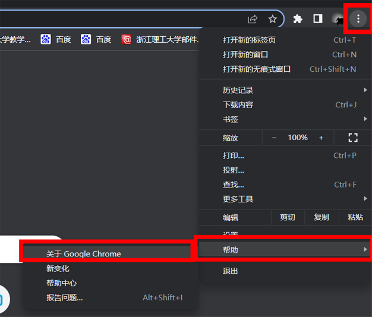

# 浙江理工大学发票查验程序
## Version
### v1.0.0
1. 选择发票图片查验；
2. PDF2PNG.exe将PDF转为PNG；
3. bat先后调用两程序；

### v2.0.0
1. 合并PDF2PNG、发票查验；
2. 增加异常判断与结束程序；
3. 增加运行错误、完成等messagebox提示；
4. 修改定位元素方式，将Full Xpath改为文本匹配方式；

### v2.1.0
打开浏览器错误原因可能为Chrome已更新，现有驱动版本不符
1. 增加Update.exe程序检测Chromedriver是否为最新版本；

### v3.0.0
1. 增加驱动版本检测与更新功能；

    运行程序时先查验chromedriver版本与chrome浏览器是否相兼容，

    若不兼容，则下载更新匹配的chromedriver。
2. chromedriver所在文件夹需添加至环境变量，无需在json文件中编辑；

### v3.1.0
1. 更新messagebox
### v3.1.1
1. 更新部分messagebox信息
2. try/except检测更新提示

### v4.0.0
1. 添加可视化界面
    * 显示Chrome、Driver版本
    * 显示所选发票文件夹、统计结果保存文件夹
    * 自行检测更新Driver
    * 通过点击按钮完成操作

### v4.1.0
1. 添加强制更新按钮
2. 更新driver后更新面板label

### v4.2.0
1. 添加Checkbutton

### v4.2.1
1. 更新删除PDF失败提示

# 使用说明

## 点击下载>>[ZstuInvoiceCheck.zip](https://github.com/Zongid/ZstuInvoiceCheck/releases/download/v4.2.1/ZstuInvoiceCheck_v4.2.1.zip)<<并解压缩

## 运行配置
### 1. 下载并安装Chrome浏览器

如已安装请忽略此步（[Chrome下载地址](https://www.google.cn/chrome/)）

### 2. 下载浏览器驱动

需根据自己的Chrome浏览器的版本选择下载（链接[Chromedriver](http://npm.taobao.org/mirrors/chromedriver/)）

附件：

* [chromedriver_win32 101.0.4951.15.zip](https://github.com/Zongid/ZstuInvoiceCheck/releases/download/v2.0.0/chromedriver_win32.101.0.4951.15.zip)
* [chromedriver_win32 101.0.4951.41.zip](https://github.com/Zongid/ZstuInvoiceCheck/releases/download/v2.0.0/chromedriver_win32.101.0.4951.41.zip)
* [chromedriver_win32 102.0.5005.27.zip](https://github.com/Zongid/ZstuInvoiceCheck/releases/download/v2.0.0/chromedriver_win32.102.0.5005.27.zip)

查看Chrome版本方式：

### 3. 把chromedriver.exe文件复制到浏览器的安装目录下

例：C:\Program Files (x86)\Google\Chrome\Application    （要根据自己实际安装目录）

### 4. 将上一步的安装目录添加到系统环境变量

例：C:\Program Files (x86)\Google\Chrome\Application    （要根据自己实际安装目录）

### 5. 修改json文件并保存

将  "username":"账号","password":"密码"  中的“账号”、“密码”修改为自己的账号密码

例：{"username":"2018327113028","password":"lyzmima"}

## 运行程序

### 6.双击ZstuInvoiceCheck.exe运行
首先选择发票文件所在文件夹，统计结果默认保存至程序所在目录，也可自行修改，点击”开始查验“按钮，程序将会把pdf文件转为png图片，然后选择文件夹中的发票图像、提取信息、查验和生成统计结果Excel文件。

# 注意

1. 仅支持浙江理工大学校园网环境；
2. 只需第一次操作1、2、3、4、5，后续可直接运行程序；
3. 支持**pdf、png、jpg、jpeg、bmp**格式的发票文件，且可混合置于同一文件夹；
4. json文件可用**记事本**、**Sublime Text**等应用程序打开修改；
5. 注意驱动版本是否与浏览器兼容，如不版本差异较大，可点击更新按钮以更新驱动
6. 仅支持**增值税电子普通发票**，深圳区块链发票、机打发票等暂不支持；
7. 图像需包含左上角**二维码**，其他部分可有可无（程序通过识别二维码获取信息）；
8. libiconv.dll、libzbar-64.dll、userdata.json**不可删除或重命名**；
9. 查验结果为**NULL**（红色加粗）时，说明未能识别出发票信息，需人工查验；
10. 若财务系统再次改版，此程序将不再适用；
11. 其他未尽事宜  <Zongid@outlook.com>
